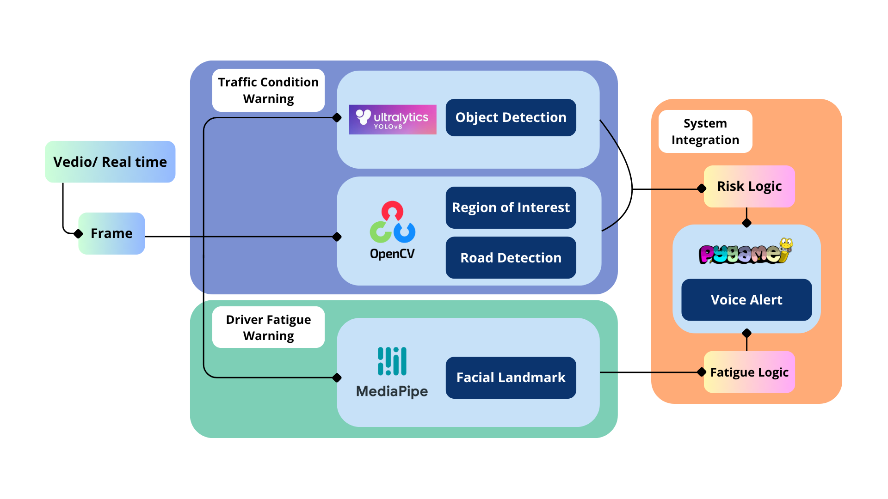

# Driver Mind AI — 智慧盲點辨識與動態警示系統

本專案致力於建立一個基於 YOLOv8 的車道風險以及疲勞風險辨識系統，結合台灣行車影像資料集進行訓練，最終提供視覺/語音警示以提升駕駛安全。

---

## 專案資料結構

```
Driver_Mind_AI/
├── BDD10K/                    # 10K 原始資料集（請手動下載放置）
│   ├── train/img + ann
│   ├── val/img + ann
│   └── test/img + ann
├── BDD10K_YOLO/               # 轉換後的 YOLOv8 資料（10K）
│   ├── images/train,val,test
│   ├── labels/train,val,test
│   └── bdd10k.yaml
├── BDD100K/                   # 100K 原始資料集（檔案過大/改以10K訓練）
│   ├── train/img + ann
│   ├── val/img + ann
│   └── test/img + ann
├── BDD100K_YOLO/              # 轉換後的 YOLOv8 資料（100K）
│   ├── images/train,val,test
│   ├── labels/train,val,test
│   └── bdd100k.yaml
├── datasets/                  # 資料轉換腳本
│   ├── convert_bdd_to_yolo.py
│   └── convert_bdd_to_yolo_2.py
├── docs/                      # 說明文檔與圖示
│   └── images/
│       └── architecture_v1.png
├── models/                    # 模型儲存區
├── notebooks/                 # EDA 與實驗記錄
├── scripts/                   # 模型訓練、推論主程式
│   └── GUI/
│       ├── audio_cache/        # 警示語音檔
│       │   ├── drowsiness_alert.mp3
│       │   ├── high_risk_alert.mp3
│       │   ├── mid_risk_alert.mp3
│       │   └── yawn_alert.mp3
│       ├── driver_risk_alert_system/       # 路況偵測
│       │   ├── assets/
│       │   ├── risk_modules/
│       │   │   ├── __init__.py
│       │   │   ├── Land_detection.py
│       │   │   ├── risk_analyzer.py
│       │   │   ├── risk_params.py
│       │   │   ├── risk_plotter.py
│       │   │   └── warning_controller.py
│       │   ├── .gitignore
│       │   ├── export_models.py
│       │   ├── lane_tracker_module.py
│       │   └── README.md
│       ├── fatigue_detection/      # 疲勞偵測
│       │   ├── app.py
│       │   ├── dlib-19.24.99-cp312-cp312-win_amd64.whl
│       │   ├── drowsiness_detection_mediapipe.py
│       │   ├── face_detection_inatall.txt
│       │   ├── README.md
│       │   ├── requirements.txt
│       │   └── shape_predictor_68_face_landmarks.dat
│       ├── audio_player.py
│       └── main_opencv_gui.py      # 啟動檔
├── .gitignore
├── .gitattributes
├── LICENSE
├── README.md
└── Requirements.txt
```
---

## 專案架構圖

下圖展示本專案的資料夾結構與主要組件流程，包含數據處理模組、YOLOv8 訓練配置與輸出對應。



---

## 安裝方式

建議使用 Conda 建立處理環境：<br>
虛擬環境名稱:driver_mind_AI

```bash
conda env create -f environment.yml
```

---

## 資料準備

請前往roboflow下載資料集： 


```
https://universe.roboflow.com/hanhan27/taiwan-traffic-dataset-v3.0
```

---

## 資料訓練

請在colab或jupyter上執行：<br>
`YOLOv8 模型訓練模組.ipynb`<br> 
`dataset_eda.ipynb`


---

## 標準轉換 (JSON → YOLO)

執行：

```bash
python datasets/convert_bdd_to_yolo_2.py
```

輸出檔案會存到`BDD10K_YOLO/labels/train/`  
`BDD10K_YOLO/labels/val/`  
`BDD10K_YOLO/labels/test/`。

---

## 模型訓練

使用 YOLOv8 CLI 指令進行訓練：

```bash
yolo task=detect mode=train model=yolov8n.pt data=BDD100K_YOLO/bdd10k.yaml epochs=50 imgsz=640
```

---

## 語音與視覺警示模組

* 使用 `pygame` 語音輸出警示語句
* 使用 `OpenCV` 顯示動態視覺 UI
* 使用 `ultralytics` 辨識物件
* 使用 `mediapipe` 辨識臉部特徵

---

## 類別定義（共 5 類）

| 類別名稱            | 類別編號 |
| --------------- | ---- |
| car             | 0    |
| person          | 1    |
| truck ( 含 bus ) | 2    |
| motor           | 3    |
| bike            | 4    |

---

## 作者名單（依姓氏筆畫排序）
朱瑋傑、李旻翰、倪曼菱、張家齊、劉元新、蘇柏軒


---

## 授權 License

本專案採用 [MIT License](LICENSE) 授權。
